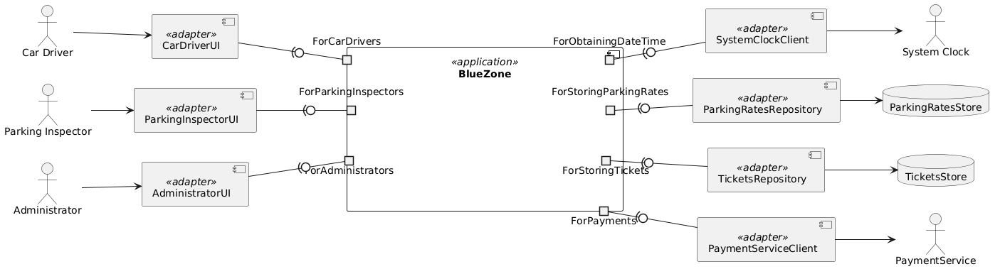

# ADR-005: BlueZone Application Ports

## Status
Accepted

## Context

In the "Ports and Adapters" architecture adopted by the BlueZone application (see [ADR-002: Apply Ports and Adapters Arhitectural Pattern](./adr-002-apply-ports-and-adapters-pattern.md)), **ports** serve as abstract interaction boundaries between the core application and its external environment—whether that be external actors (driving ports), infrastructure services (driven ports), or internal concerns (e.g., storage or time access).

This ADR defines the **initial complete set of application ports**, derived from:
- Use case specifications (external driving ports),
- Acceptance test specifications (internal ports), and
- Identified external system dependencies (external driven ports).

These ports are expressed as groups of abstract interfaces (typically as `Protocol`s in Python) that reside in well-defined modules under the `ports/` package. This structure enables both implementation modularity and cross-language reuse via Set-Based Engineering principles.

## Decision

### 🔹 External Driving Ports (Initiated by Human Actors)

These ports are **actor-centric**. Each actor has a corresponding module under `ports/` that contains multiple `Protocol`s, each representing a specific operation or interaction pattern. This approach supports semantic consistency and simplifies adapter selection based on deployment strategy.

- `ForCarDrivers`:
  - e.g., `BuysTickets`, `CancelsTickets`, `GetsRemainingTime`, etc.
- `ForParkingInstectors`
  - e.g., `ChecksCars`, `IssuesFines`
- `ForAdministrators`
  - e.g., `DefinesParkingRates`, `ConnectsPaymentService`, `ArchivesOldTickets`

This modular structure avoids violating the Open-Closed Principle by keeping protocols per operation, while allowing adapters to implement the module partially or fully depending on context.

### 🔹 External Driven Ports (Connected to Third-Party Systems)

These ports abstract communication with external systems and services. They are **driven** by the core application.

Each port is named based on its purpose and external system dependency:

- `ForPayments`: communicates with the external Payment Service
- Others may be added later (e.g., `ForSendingNotifications`)

### 🔹 Internal Driven Ports (Supporting Core Functionality)

These ports encapsulate internal, technology-dependent operations required by the application core, derived from shared test and persistence expectations. They are **driven** by the core logic and implemented in platform-specific ways.

Current internal ports include:

- `ForStoringTickets`: persistent storage for parking tickets
- `ForStoringParkingRates`: storage and retrieval of parking zone pricing
- `ForObtainingDateTime`: retrieves the current date/time from a trusted clock source
- `ForStoringFines` *(tentative, pending fine management use case evolution)*

These will also reside in the `ports/` package and may eventually be reused across implementations or services.

## UML Diagram

The initial structure of external and internal ports will be illustrated in the following diagram:

## Benefits

- Provides a clear, consistent interface model for core application logic
- Keeps use case–driven logic decoupled from technology or infrastructure
- Supports multiple competing implementations in different languages or stacks
- Aligns with Set-Based Engineering and modular architecture goals
- Prevents architectural drift by naming all discovered ports explicitly

## Consequences

- Implementation teams must maintain discipline in separating port definitions from adapters
- Language-specific structure (e.g., `ports/` as a package) may differ slightly across environments
- New ports or protocol refinements may require careful evolution of the shared specification

## Out of Scope

- Reflecting port and operation names in modules, classes, and/or functions (programming language-specific)
- Concrete adapter implementations (language- and platform-specific)
- Service partitioning and deployment boundaries (covered in a future ADR)

## References

- [ADR-001: Use PlantUML for Diagrams](./adr-001-use-plantuml-for-architecture-diagrams.md)
- [ADR-002: Apply Ports and Adapters Architecture Patterns](./adr-002-apply-ports-and-adapters-pattern.md)
- [ADR-004: Use Gherkin for Acceptance Tests](./adr-004-use-gherkin-for-acceptance-test-specifications.md)
- [Set-Based Engineering and Ports Model (Sterkin, 2025)](https://medium.com/@asher-sterkin/focus-on-core-value-and-keep-cloud-infrastructure-flexible-with-ports-adapters-af79c5fa1e56)

