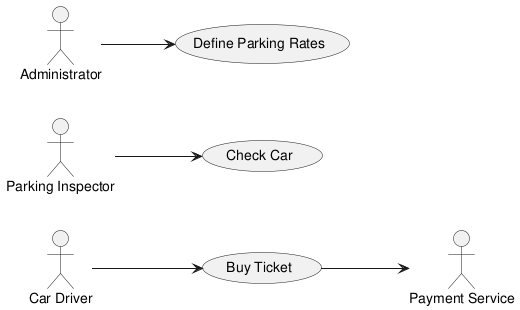

# Use Case Model

## Introduction

The **BlueZone** application provides a convenient way for Car Drivers to pay remotely for parking in regulated zones within a city. Instead of using coins at parking meters, drivers can purchase parking tickets through the application. Parking Inspectors can use the application to verify if a car is legally parked in a specific zone.

## Blue Zone Use Cases

The following table outlines the primary use cases of the BlueZone application:

| **Name**                     | **Description** |
| ---------------------------- | --------------- |
| [Buy Ticket](./BuyTicket.md) | This use case allows a Car Driver to purchase a parking ticket for a specific zone. The driver selects the zone, enters payment details, and receives a parking ticket upon successful payment. |
| [Check Car](./CheckCar.md)   | This use case enables a Parking Inspector to check if a car is legally parked in a particular zone. The inspector submits the car's plate number and the zone, and the system returns the parking status. |
| [Define Parking Rates](./DefineParkingRates.md)   | This use case allows an Administrator to set or update the parking rates for specific zones. The Administrator provides the rate details, and the system stores these rates for use in ticket purchases. |

---
